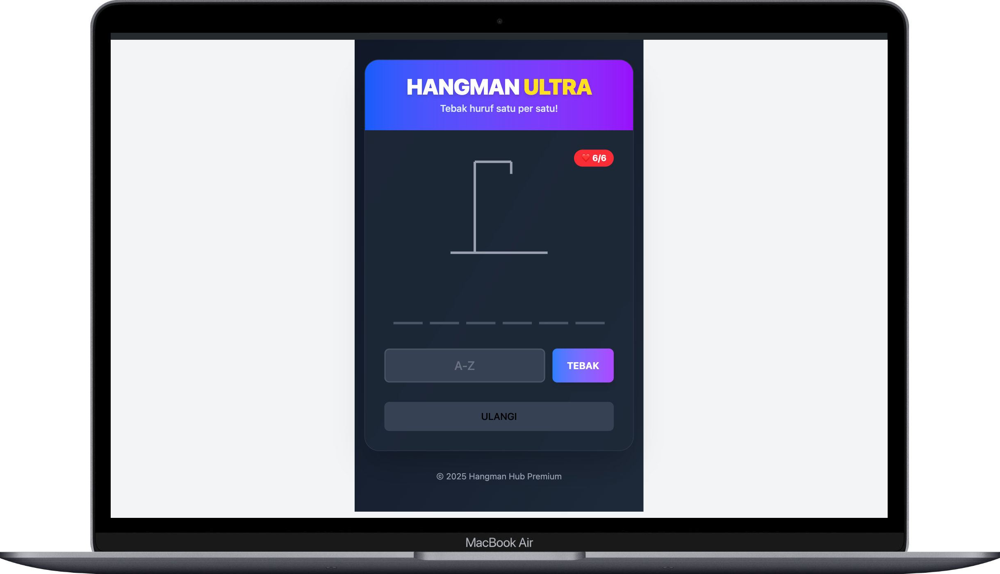

# README ini tersedia dalam beberapa bahasa

- [English](README.md)
- [Bahasa Indonesia](README.id.md)

Untuk membaca README dalam Bahasa Ingggris, silakan buka file [README.md](README.md).

<hr>

# Hangman's Hub



**Hangman's Hub** adalah game tebak kata online yang seru dan bikin penasaran. Dibuat pakai teknologi modern seperti [Svelte](https://svelte.dev) dan [Bun](https://bun.sh), game ini cepat, ringan, dan gampang dipakai di semua perangkat.

## Fitur Utama

- **Tebak Kata Klasik**: Main tebak kata dengan berbagai level kesulitan yang bikin ketagihan.
- **Desain Responsif**: Tampil keren di layar HP atau komputer.
- **Teknologi Canggih**: Dibangun dengan Svelte dan Bun, jadi performanya ngebut.

  

## Prasyarat

Sebelum mulai, pastikan kamu sudah punya:

- [Bun](https://bun.sh) di komputer kamu.
- Git buat kloning repositori.

## Cara Instalasi

Ikuti langkah-langkah ini buat jalanin Hangman's Hub di komputer kamu:

1. **Kloning Repositori**

   Download kode sumbernya:

   ```bash
   git clone https://github.com/zoelabbb/hangman-svelte.git
   cd hangman-svelte
   ```

2. **Instal Dependensi**

   Pakai Bun buat instal semua yang dibutuhin:

   ```bash
   bun install
   ```

3. **Jalankan Aplikasi**

   Mulai server lokalnya:

   ```bash
   bun run dev
   ```

4. **Akses Game**

   Buka browser dan mainkan di [http://localhost:3000](http://localhost:3000).

## Struktur Proyek

Folder dan file di proyek ini diatur biar gampang dikembangin:

```
src/
├── lib/
│   ├── games/
│   │   └── hangman/
│   │       ├── HangmanGame.svelte    # Komponen utama game
│   │       ├── words.ts              # Daftar kata
│   │       └── types.ts              # Definisi tipe data
│   │
├── routes/
│   └── +page.svelte                  # Halaman utama
│
└── app.css                           # Gaya global (TailwindCSS)
```

## Kontribusi

Punya ide keren atau mau bantuin? Yuk, bikin pull request atau buka issue di repositori ini.

## Lisensi

Kode ini pakai [MIT License](LICENSE). Kamu bebas pakai, ubah, atau bagikan sesuai aturan lisensinya.

---

**Hangman's Hub** cocok banget buat kamu yang suka tantangan tebak kata. Yuk, main sekarang dan tunjukin skill kamu!
