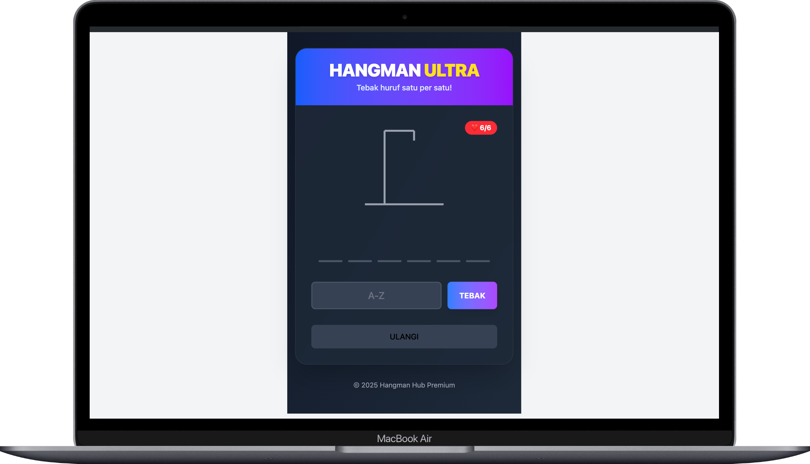
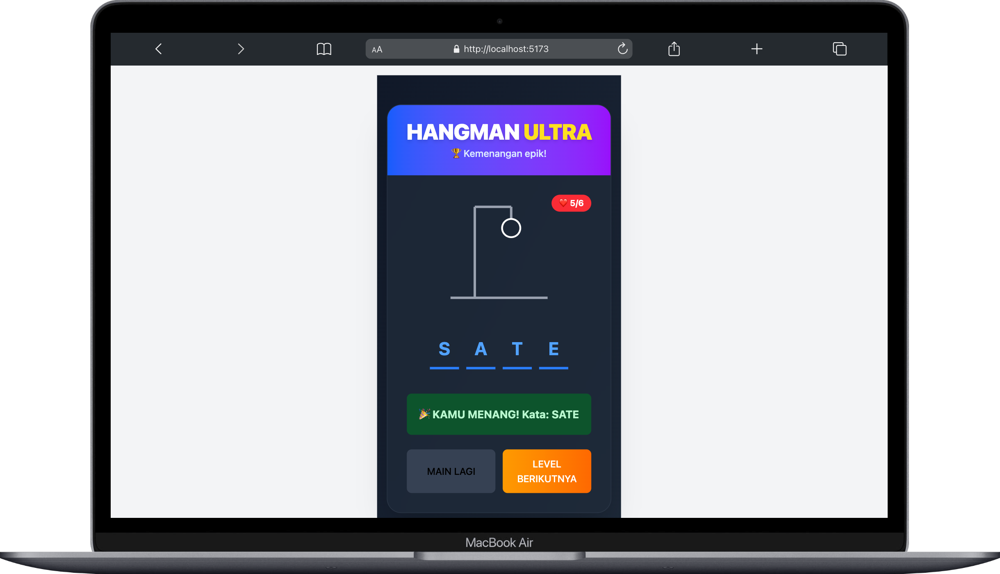

## This README is available in multiple languages

- [English](README.md)
- [Bahasa Indonesia](README.id.md)

To read the README in Bahasa Indonesia, please open the file [README-ID.md](README-ID.md).

<hr>

# Hangman's Hub



**Hangman's Hub** is an exciting and engaging online word-guessing game. Built with modern technologies like [Svelte](https://svelte.dev) and [Bun](https://bun.sh), this game is fast, lightweight, and works seamlessly on all devices.

## Key Features

- **Classic Word Guessing**: Play word-guessing games with various difficulty levels that keep you hooked.
- **Responsive Design**: Looks great on both mobile and desktop screens.
- **Advanced Technology**: Built with Svelte and Bun for blazing-fast performance.

  

## Prerequisites

Before you start, make sure you have:

- [Bun](https://bun.sh) installed on your computer.
- Git for cloning the repository.

## Installation Steps

Follow these steps to run Hangman's Hub on your computer:

1. **Clone the Repository**

   Download the source code:

   ```bash
   git clone https://github.com/zoelabbb/hangman-svelte.git
   cd hangman-svelte
   ```

2. **Install Dependencies**

   Use Bun to install all required dependencies:

   ```bash
   bun install
   ```

3. **Run the Application**

   Start the local server:

   ```bash
   bun run dev
   ```

4. **Access the Game**

   Open your browser and play at [http://localhost:3000](http://localhost:3000).

## Project Structure

The project's folders and files are organized for easy development:

```
src/
├── lib/
│   ├── games/
│   │   └── hangman/
│   │       ├── HangmanGame.svelte    # Main game component
│   │       ├── words.ts              # Word list
│   │       └── types.ts              # Type definitions
│   │
├── routes/
│   └── +page.svelte                  # Main page
│
└── app.css                           # Global styles (TailwindCSS)
```

## Contribution

Have a cool idea or want to help? Feel free to create a pull request or open an issue in this repository.

## License

This code is licensed under the [MIT License](LICENSE). You are free to use, modify, or share it under the terms of the license.

---

**Hangman's Hub** is perfect for those who love word-guessing challenges. Start playing now and show off your skills!
